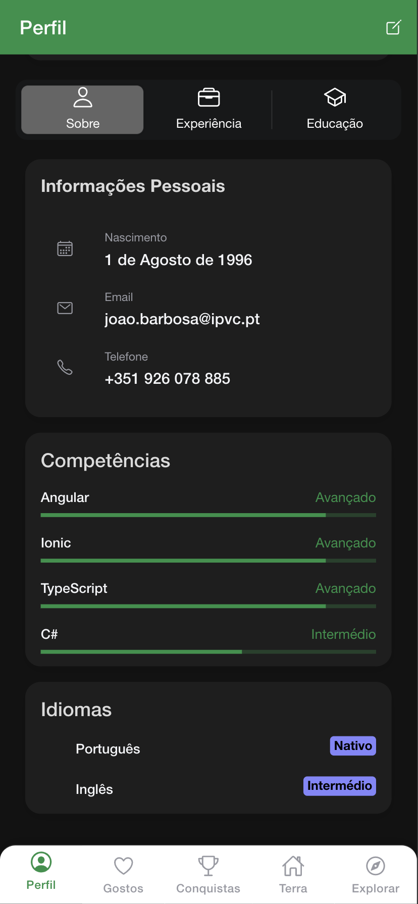
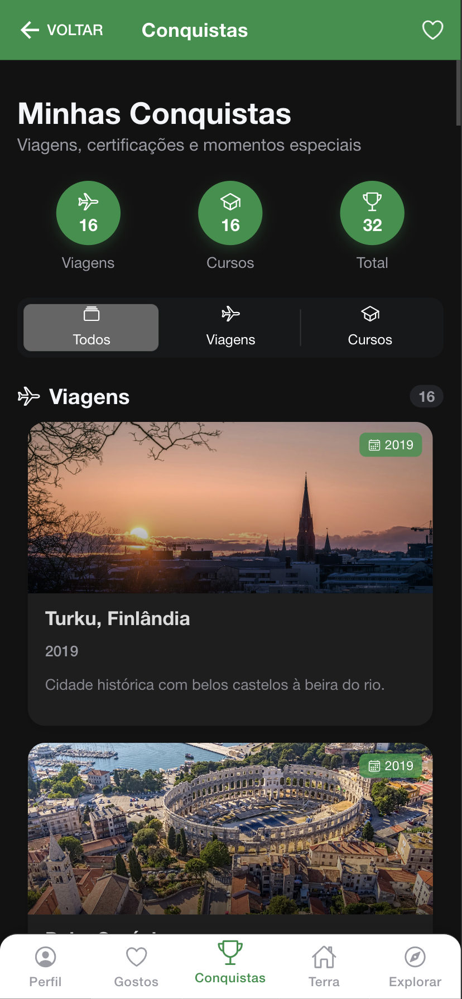
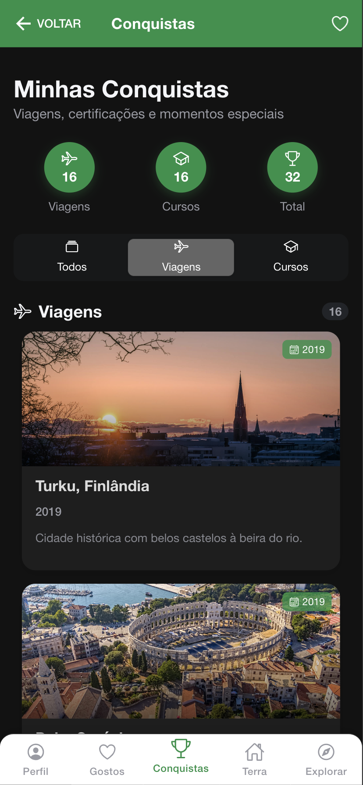
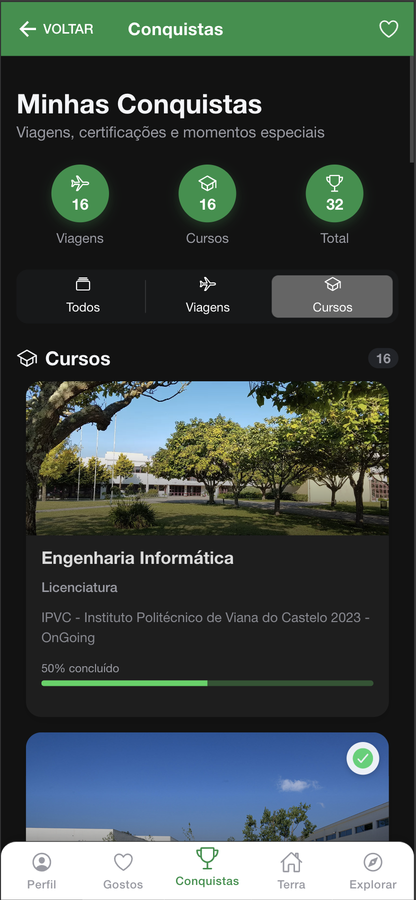
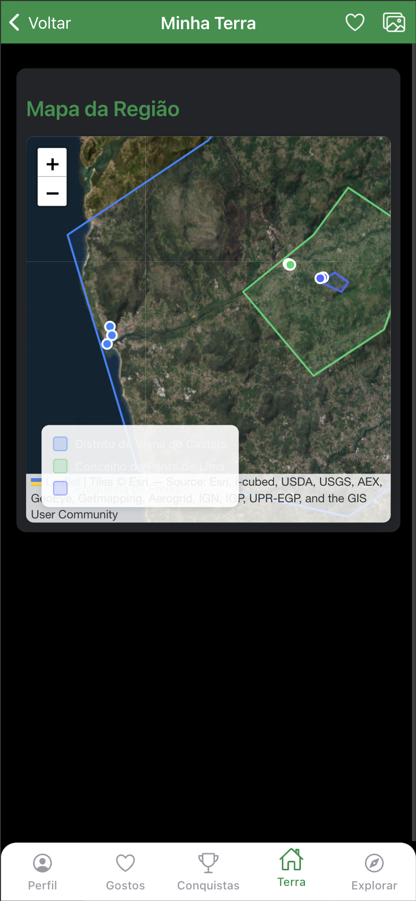
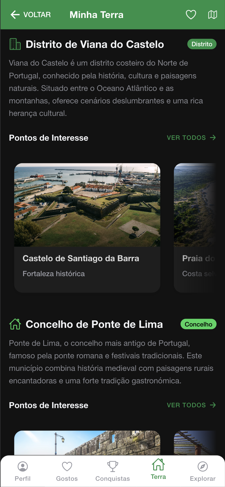
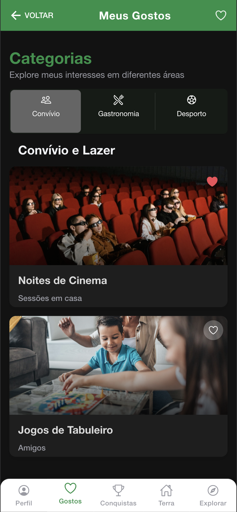
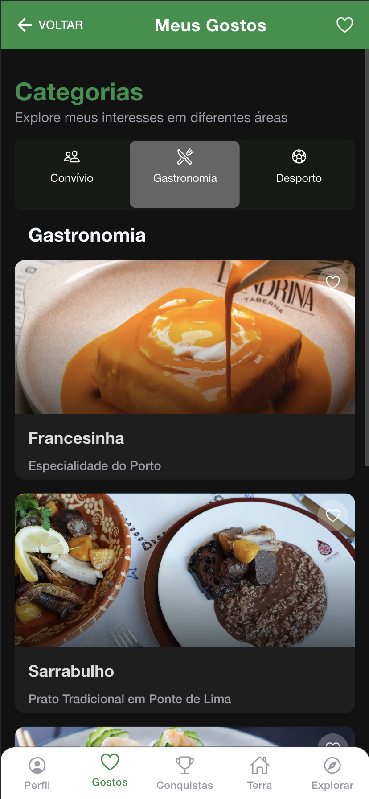
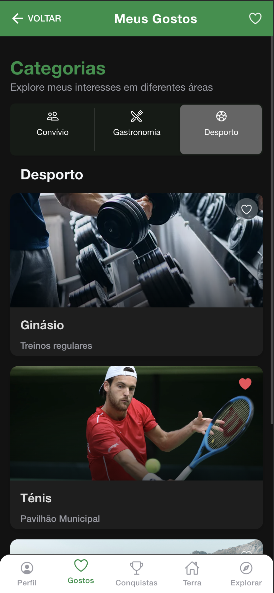
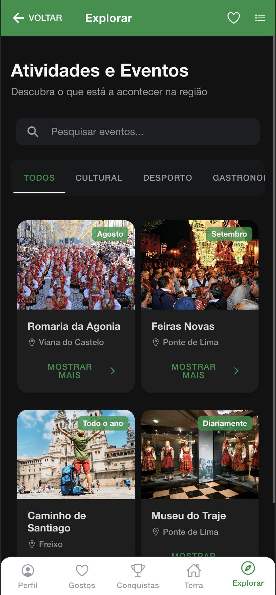

# 📱 Caminhos & Conquistas


**Caminhos & Conquistas** é uma aplicação móvel desenvolvida com Ionic e Angular que apresenta um portfolio pessoal interativo. Criada como projeto da cadeira de Interação Homem-Máquina, esta aplicação demonstra um design responsivo em dispositivos móveis.
Com ele é possível ver as minhas informações pessoais, conquistas, gostos e explorar a terra natal de forma intuitiva e envolvente.

<div align="center">
  
</div>

## 📋 Índice

- [Características](#-características)
- [Screenshots](#-screenshots)
- [Instalação](#-instalação)
- [Tecnologias](#-tecnologias)
- [Estrutura do Projeto](#-estrutura-do-projeto)
- [Funcionalidades](#-funcionalidades)
- [Contribuição](#-contribuição)
- [Licença](#-licença)
- [Contato](#-contato)

## ✨ Características

- **Design Intuitivo**: Interface de utilizador moderna e responsiva
- **Navegação por Tabs**: Acesso rápido às diferentes seções do portfolio
- **Animações Fluidas**: Transições suaves entre componentes
- **Modo Offline**: Funcionalidades principais disponíveis sem conexão à internet
- **Design Adaptativo**: Layout otimizado para diferentes tamanhos de ecrã

## 📸 Screenshots

### Página de Perfil

<div align="center">
  
  
  
</div>

A página de perfil oferece uma visão completa das informações pessoais e profissionais, organizada em três seções principais através de um segmento de navegação:
- **Sobre**: Dados pessoais, competências e idiomas
- **Experiência**: Histórico profissional detalhado
- **Educação**: Formação acadêmica e certificações

### Página de Conquistas

<div align="center">
  
  
  
</div>

A seção de conquistas permite visualizar viagens e cursos concluídos, com:
- Alternância entre visualizações em cards ou grid
- Filtros para categorias específicas (viagens/cursos)
- Modal detalhado ao clicar em cada item

### Página Terra Natal

<div align="center">
  
  
</div>

Exibição interativa da terra natal com:
- Mapa da região com marcadores e polígonos (distrito, concelho, freguesia)
- Lista de pontos de interesse por localidade
- Informações detalhadas sobre atrações locais

### Página de Gostos

<div align="center">
  
  
  
</div>

Apresentação de preferências pessoais organizadas por categorias:
- Convívio
- Gastronomia
- Desporto

### Página Explorar

<div align="center">
  
  
</div>

Descoberta de eventos e atividades regionais:
- Filtros por categoria
- Alternância entre visualizações
- Sistema de favoritos integrado
- Detalhes de cada evento

## 🚀 Instalação

```bash
# Clone o repositório
git clone https://github.com/JotaBarbosaDev/Caminhos-Conquistas

# Entre no diretório
cd Caminhos-Conquistas

# Instale as dependências
npm install

# Execute o projeto localmente
ionic serve

# Para gerar APK/IPA
ionic capacitor build android
# ou
ionic capacitor build ios
```

## 💻 Tecnologias

- **Ionic Framework 7**: Interface mobile responsiva
- **Angular 16**: Framework front-end
- **TypeScript**: Linguagem de programação
- **Capacitor**: Builds nativas para iOS e Android
- **SCSS**: Estilização avançada
- **Animate.css**: Biblioteca de animações

## 📁 Estrutura do Projeto

```
src/
├── app/
│   ├── components/         # Componentes reutilizáveis
│   │   ├── detail-modal/   # Modal de detalhes
│   │   ├── favorites/      # Sistema de favoritos
│   │   └── settings/       # Configurações
│   ├── conquistas/         # Página de conquistas
│   ├── explorar/           # Página de exploração
│   ├── gostos/             # Página de gostos
│   ├── perfil/             # Página de perfil
│   ├── terra/              # Página sobre terra natal
│   ├── services/           # Serviços compartilhados
│   └── tabs/               # Navegação principal
├── assets/
│   ├── icon/               # Ícones do aplicativo
│   └── images/             # Imagens utilizadas
└── theme/                  # Variáveis e temas
```

## 🔍 Funcionalidades

### Perfil Pessoal Interativo
- Visualização segmentada de informações
- Progress bars para as competências
- Bandeiras para idiomas

### Sistema de Conquistas
- Organização de conquistas pessoais e profissionais
- Filtros por categorias (viagens, cursos)
- Visualização em cards ou grid

### Exploração Regional
- Mapa interativo da terra natal com polígonos administrativos
- Marcadores de pontos de interesse
- Alternância entre mapa e galeria

### Personalização de Gostos
- Interface organizada por categorias
- Cards expansíveis para cada preferência
- Sistema de favoritos integrado

### Funcionalidade de Favoritos
- Marcação de itens favoritos em todas as seções
- Acesso rápido aos favoritos
- Sincronização com armazenamento local

## 🤝 Contribuição

Contribuições são bem-vindas! Para contribuir:

1. Faça um Fork do projeto
2. Crie sua Feature Branch (`git checkout -b feature/AmazingFeature`)
3. Commit suas mudanças (`git commit -m 'Add some AmazingFeature'`)
4. Push para a Branch (`git push origin feature/AmazingFeature`)
5. Abra um Pull Request

## 📄 Licença

Distribuído sob a licença MIT. Veja `LICENSE` para mais informações.

## 📬 Contato

### Email João Barbosa:
- Pessoal: jotambbarbosa@gmail.com
- Acadêmico: joao.barbosa@estg.pt

Link do projeto: [https://github.com/JotaBarbosaDev/Caminhos-Conquistas](https://github.com/JotaBarbosaDev/Caminhos-Conquistas)

---

<div align="center">
  <sub>Desenvolvido com ❤️ por João Barbosa</sub>
</div>
